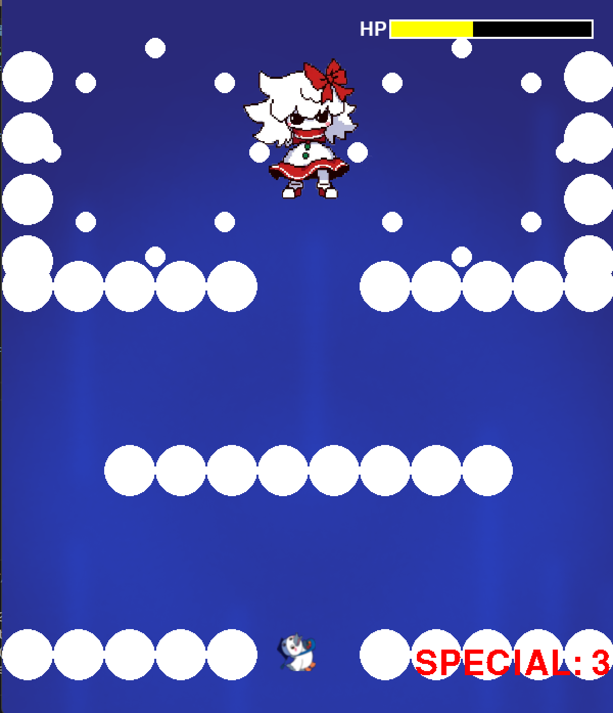
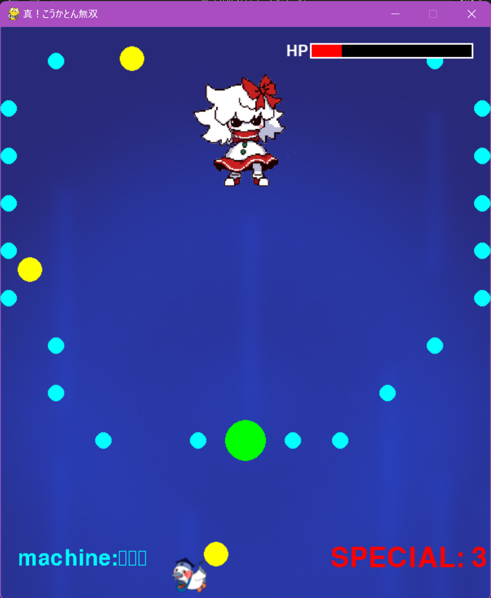
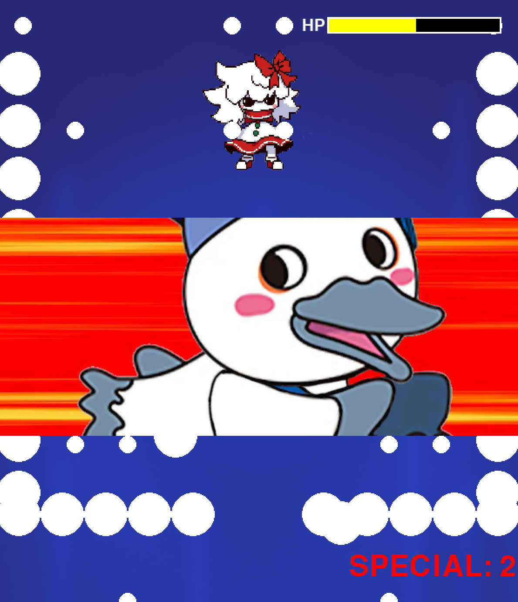
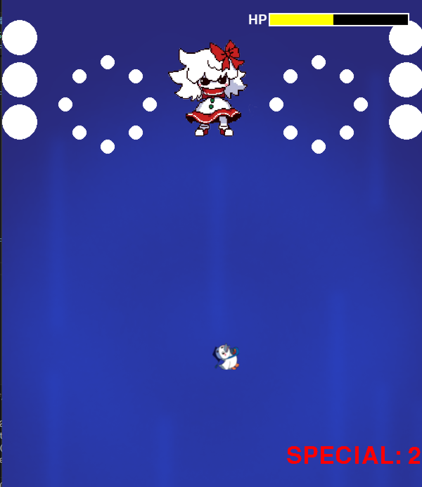

# 東方風の弾幕ゲーム

## 実行環境の必要条件
* python >= 3.10
* pygame >= 2.1

## ゲームの概要
* ジャンル：弾幕ゲーム
* 東方を参考にした弾幕ゲームです。

## ゲームの遊び方
* 東方の弾幕ゲームと同じ
* 主人公の残機は3個、弾幕を避けつつボスに攻撃を当てて撃破する。
* スペシャルは画面内の弾幕を全て消去する。3回まで発動可能
* HP60,30%のときに攻撃方法が変わる

## HP60%以下のとき

## HP30%以下のとき

## スペシャル発動前

## スペシャルカットイン

## スペシャル発動後

## 操作方法
* 操作　　　 ：WASDキー
* 低速移動ON ：nキー
* 低速移動OFF：mキー
* 攻撃　　　 ：SPACEキー
* ボム発動　 ：bキー

## ゲームの実装
### 共通基本機能
* 背景画像と主人公キャラクター、ボスの描画
* ボスのHPバー

### 分担追加機能
* ボム実装 （担当：熊谷）：弾幕を全消去する「ボム」の実装
* フェーズ1（担当：小林）：レーザーを使った攻撃
* フェーズ2（担当：岸）　：花形に広がる弾幕
* フェーズ3（担当：河田）：ランダムな弾幕
* 残機機能 （担当：河田）：残機をすべて失ったらゲームオーバー
* 自機判定 （担当：河田）：キャラクターの描画より小さい当たり判定

### ToDo
- [x] ボム機能
- [x] フェーズ1
- [x] フェーズ2
- [x] フェーズ3
- [x] 残機機能
- [x] 自機判定

### メモ
* 弾幕の種類
* 共通で使用する変数の追加はdiscordで報告すること
* すべてのクラスに関係する関数は，クラスの外で定義してある
